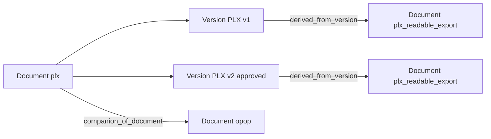

# Архитектура: documents (ядро) и plans (PLX-фасад)

Документ фиксирует границу приложений, будущие типы документов (пока без кода) и концепцию связей `DocumentRelation`.  
Связанное ТЗ: [planing-2605010.md](planing-2605010.md) §10.2.

---

## 1. Граница apps

| Слой | Роль | Примеры |
|------|------|---------|
| **documents** | Универсальное ядро | `Document`, `DocumentVersion`, Alias, Workflow, Discussion; позже `DocumentRelation`; порты storage / hash / naming / extractor |
| **plans** | PLX-фасад (тип «учебный план») | список и фильтры УП, upload PLX, parser, канонические имена, abbr dict, yandex |

### Правила

1. Новые виды документов живут в той же системе `documents` (свой `document_type` + при необходимости тонкий UI-модуль рядом с `plans`).
2. PLX-специфику **не** переносить в ядро `documents`.
3. Legacy-модель `EducationalPlan` удалена (миграция `plans.0008_remove_educationalplan`). Данные УП — только `Document` / `DocumentVersion`.

### Имя типа учебного плана

| В ТЗ (исторически) | В коде | Смысл |
|--------------------|--------|--------|
| `study_plan` | **`plx`** | Учебный план в формате PLX |

Код `plx` = учебный план (PLX). Переименовывать enum не требуется; в UI пользователю показывается «Учебный план», не идентификатор типа.

```text
documents  ── универсальные операции (версия, статус, обсуждение, хранение)
    ▲
    │ использует
plans      ── UI и логика именно для document_type = plx
```

---

## 2. Будущие типы документов (не хардкодить в коде до появления файлов)

Предварительные коды — **только для документации**. В `DocumentType` пока не добавлять.

### 2.1. Читаемая выгрузка PLX → XLSX

| | |
|--|--|
| **Суть** | Экспорт из редактора PLX «АС ПЛАНЫ» (в обиходе «синяя звезда» по иконке/логотипу) в XLSX для публикации на сайте вуза (внешний сайт, не этот проект). Ранее встречались варианты в PDF. |
| **Предлагаемый `document_type`** | `plx_readable_export` (допустимый синоним в обсуждениях: `plx_xlsx_export`) |
| **Якорь связи** | **Версия УП** (`DocumentVersion` документа с типом `plx`) |
| **Жизненный цикл** | Устаревает при **утверждении** новой версии УП: актуальная читаемая выгрузка должна соответствовать утверждённому PLX. Старая выгрузка остаётся в истории своей цепочки / помечается неактуальной относительно нового якоря. |
| **Публичность** | Может понадобиться прямая ссылка на файл для размещения на сайте вуза. |
| **Происхождение** | В первой очереди — принимаем готовый файл из «синей звезды». Собственный экспорт из PLX — позже, по необходимости. |

### 2.2. ОПОП

| | |
|--|--|
| **Суть** | Описание примерной образовательной программы; составляется в связке с УП, с большой долей ручной работы; публикуется вместе с планом на сайте вуза. |
| **Предлагаемый `document_type`** | `opop` |
| **Якорь связи** | **Документ УП** (`Document` типа `plx`) — на всю цепочку версий |
| **Жизненный цикл** | **Не обязан** устаревать при обновлении PLX: ту же версию ОПОП можно оставлять связанной с УП после появления новых версий плана. |
| **Происхождение** | Ручная подготовка + загрузка в систему. |



Будут и другие типы документов; для них действует то же правило: ядро `documents` + при необходимости отдельный тонкий UI-слой.

---

## 3. Концепция DocumentRelation (проектирование, без реализации)

Код модели и enum видов связей **пока не вводятся**. Ниже — зафиксированная концепция для будущей реализации.

### 3.1. Зачем две «силы» якоря

Одного FK «документ → документ» недостаточно:

- XLSX-выгрузка привязана к **версии** УП;
- ОПОП привязан к **документу** УП (ко всей цепочке версий).

Универсальная связь должна поддерживать оба якоря.

### 3.2. Логическая модель

`DocumentRelation`:

| Поле | Смысл |
|------|--------|
| `source_document_id` | Документ-источник связи (всегда есть) — у XLSX/ОПОП это их собственный `Document` |
| `target_document_id` | Документ-якорь (УП); **всегда заполнен** |
| `target_version_id` | Версия-якорь (версия УП); для version-scoped обязателен, для document-scoped = `NULL` |
| `relation_kind` | Вид связи (см. словарь ниже) |
| `is_primary` / `role` | При нескольких связях одного вида — какая «текущая» для публикации |
| `valid_from` / `superseded_at` | Опционально: явное устаревание без удаления записи |

**Предпочтительный инвариант (для реализации):**

- связь всегда хранит `target_document_id`;
- для version-scoped видов дополнительно обязателен `target_version_id`;
- для document-scoped видов `target_version_id` = `NULL`.

Так «все приложения к этому УП» ищутся одним запросом по `target_document_id`.

### 3.3. Словарь `relation_kind` (стартовый, расширяемый)

| kind | Якорь | Пример | Поведение при новой утверждённой версии УП |
|------|-------|--------|-----------------------------------------------|
| `derived_from_version` | version | XLSX-выгрузка | Старая связь не удаляется; для публикации берётся derived от **новой** approved-версии (или предыдущий derived помечается `superseded`) |
| `companion_of_document` | document | ОПОП | Без авто-устаревания; пользователь явно загружает новую версию ОПОП при необходимости |

Позже допустимы `replaces`, `translates`, `attachment_of` и т.п. Словарь расширяемый; до первой реализации в коде как enum не фиксировать жёстко.

### 3.4. Политики

1. **Публичная ссылка** — на файл текущей версии связанного документа (storage URL / download endpoint), не «голый» внутренний id без контроля доступа.
2. **Каскад** — при удалении УП связанные документы не удалять молча: orphan или мягкая отвязка + предупреждение.
3. **Утверждение PLX** — хук workflow `approve` на версии `plx`: для `derived_from_version` предложить/потребовать новую читаемую выгрузку; для `companion_of_document` автоматически ничего не делать.
4. **Карточка УП** — блоки «Читаемая выгрузка (к текущей/утверждённой версии)» и «ОПОП (к плану)».

### 3.5. Что не смешивать

| Механизм | Назначение |
|----------|------------|
| `DocumentAlias` | Идентичность **одного** документа (имена файлов / алиасы), не связь между разными документами |
| `documents.relationship_map` | Целостность внутренних ссылок (version↔document, thread↔version); не граф «связанных документов» |
| `DocumentRelation` (будущее) | Связи между разными документами / версиями (производные, сопутствующие) |

---

## 4. Что уже сделано / что позже

| Сделано | Позже (отдельный этап) |
|---------|-------------------------|
| Cutover: данные УП на `Document`, `EducationalPlan` удалена | Модель и API `DocumentRelation` |
| Граница apps и типы XLSX / ОПОП описаны здесь | Значения в `DocumentType`, UI загрузки связанных файлов |
| Концепция связей зафиксирована | Хуки `approve` для derived-выгрузок |
