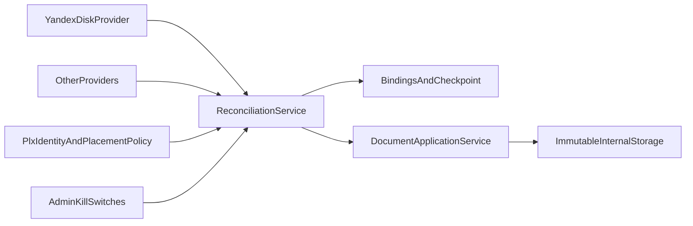
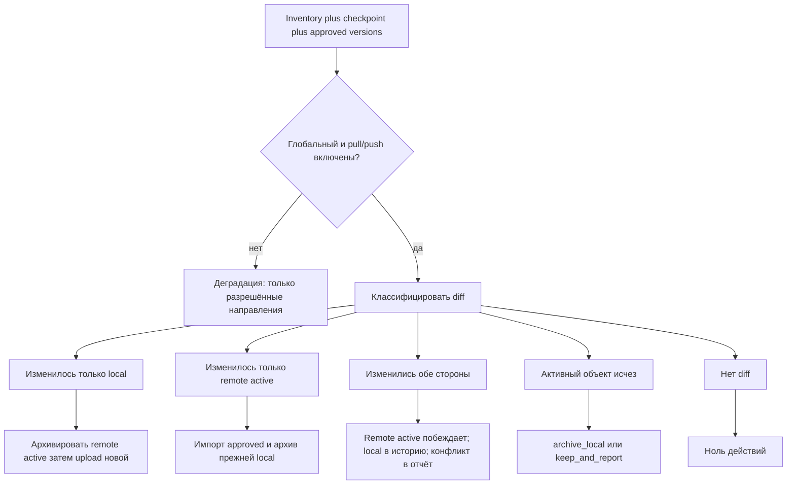

# Синхронизация внешних хранилищ

Архитектурное решение постоянного согласования утверждённых (и архивных) версий документов с внешними облачными каталогами. Первый адаптер — Яндекс.Диск учебного отдела. Документ заменяет прежнее решение «однократный импорт, затем источник истины только система».

Связанные документы:

- [architecture-documents-vs-plans.md](architecture-documents-vs-plans.md) — граница `documents` / `plans` / `external_sync`;
- [Сервис для PLX.md](Сервис%20для%20PLX.md) §14 — исторический MVP-импорт, теперь superseded;
- [planing-2605010.md](planing-2605010.md) §10.12, §10.16 — то же.

Статус: концепция согласована, прикладной код ещё не реализован. Существующие `plans.yandex_client` и `update_from_yandex` — односторонний прототип; их логику не расширять, а заменить адаптером и согласователем из этого документа.

---

## 1. Цели

1. Папка актуальных PLX на Яндекс.Диске остаётся в употреблении: туда уходят утверждённые через систему версии, оттуда приходят файлы, положенные учебным отделом вручную.
2. Архивные ветки (`Архив` / `АРХИВ`, в т.ч. годовые подпапки) сохраняют историю; содержимое архива не перезаписывается.
3. Полный цикл документа (черновик → проверка → утверждение) живёт в системе; внешнее хранилище видит только утверждённые и архивные версии.
4. Механизм расширяем: следующий облачный провайдер подключается адаптером, без смены жизненного цикла документов.
5. Любую внешнюю подсистему можно нейтрализовать административным рубильником; локальный реестр при этом остаётся работоспособным.

Нецели первой реализации:

- `rclone bisync` как управляющий механизм;
- двустороннее зеркалирование черновиков и версий на проверке;
- автоматическое создание публичных ссылок Яндекс.Диска;
- Celery/RQ как обязательная зависимость (до этапа 7 достаточно management command + внешнее расписание).

---

## 2. Почему не rclone bisync

`rclone bisync` сравнивает пути, размеры и даты. Он не знает статусов версий, указателя утверждённой версии, дедупликации по содержимому, аудита и транзакций БД. Конфликт «newer wins» способен затереть архив или опубликовать черновик.

Допустимо:

- использовать REST API Яндекс.Диска (`yadisk`) как первый `ExternalStorageProvider`;
- позже добавить `RcloneProvider` или файловый адаптер **за тем же** `ReconciliationService`;
- односторонний `rclone copy` во staging только как транспорт, если провайдер не умеет list/download напрямую.

Управляет смыслом всегда согласователь, не утилита синхронизации файлов.

---

## 3. Границы модулей

```text
external_sync  ── подключения, checkpoint, привязки, запуски, намерения публикации, рубильники
       │ вызывает
documents      ── версии, статусы, утверждение, неизменяемое внутреннее хранение, аудит workflow
       ▲
       │ использует
plans          ── идентичность PLX, метаданные, PlacementPolicy (раскладка по папкам УО)
```

| Контекст | Ответственность | Не знает |
|----------|-----------------|----------|
| **documents** | `Document` / `DocumentVersion`, workflow, hash, внутренний `StoragePort`, use case доверенного импорта и публикации | OAuth, пути Яндекс.Диска, rclone, имена папок факультетов |
| **plans** | matching PLX, канонические имена, abbr dict, `PlacementPolicy`, UI карточки УП | как хранится checkpoint, как вызывается API облака |
| **external_sync** | провайдеры, инвентаризация, трёхстороннее согласование, очередь исходящих намерений, отчёт запуска | разбор XML PLX, правила `on_review` ↔ `needs_fix` |

Правила:

1. Облачные SDK, токены и обход папок живут только в `external_sync` (адаптеры) и не протекают в `documents`.
2. PLX-специфику путей (`Архив`, аббревиатуры факультетов) не переносить в ядро: это `PlacementPolicy` в `plans`.
3. Все изменения версий извне идут через прикладные операции `documents` (сервисный исполнитель + `WorkflowTransition`), не через прямую запись ORM.
4. Существующий `ingest_plx_file` остаётся точкой входа загрузки байт; для внешнего импорта добавляется отдельный use case с доверенным статусом `approved` / `archived`.



---

## 4. Источник истины

Система — полный реестр всех версий и workflow. Яндекс.Диск — оперативный каталог **утверждённых актуальных** файлов и их архивных копий для учебного отдела.

Приоритет при расхождении:

- актуальная папка Яндекс.Диска побеждает как опубликованный утверждённый файл;
- локальная версия при этом не удаляется, остаётся в истории;
- черновики и версии на проверке никогда не вытесняют утверждённую внешнюю копию и сами на диск не публикуются.

Первичный запуск не является отдельным `force`/`resync`. Пустая БД и пустой checkpoint естественно импортируют:

- объекты вне архивных сегментов пути — как утверждённые актуальные версии;
- объекты внутри `Архив`/`АРХИВ` (регистронезависимо, на любом уровне) — как архивные исторические версии.

По состоянию весеннего снимка `userfiles` (без `other/`): порядка 506 активных и 222 архивных PLX. Цифры ориентир для ёмкости, не жёсткий контракт.

---

## 5. Модели состояния

Логические сущности (имена полей — рабочие; точные Django-модели появятся на этапе 2).

### 5.1. Подключение `ExternalConnection`

| Поле | Смысл |
|------|--------|
| `id`, `name` | Идентификатор и отображаемое имя («Яндекс.Диск УО») |
| `provider_key` | `yandex_disk`, позже `webdav`, `s3`, `rclone_fs` |
| `root_path` | Корень обхода (например `/` или папка факультетов) |
| `credential_ref` | Ссылка на секрет (env / secret store), не сам токен |
| `enabled` | Локальный рубильник подключения (под глобальным) |
| `pull_enabled` | Получать изменения |
| `push_enabled` | Отправлять утверждённые версии |
| `schedule_enabled` | Автозапуск по расписанию |
| `manual_run_enabled` | Разрешение ручного запуска |
| `on_active_missing` | `archive_local` или `keep_and_report` |
| `last_checkpoint_at` | Время последнего успешно завершённого согласования |

Глобальная настройка процесса: `external_sync_enabled` (рубильник всего контура).

### 5.2. Слепок `RemoteObjectSnapshot` (checkpoint)

На каждый известный удалённый объект после успешного шага:

| Поле | Смысл |
|------|--------|
| `connection_id` | Подключение |
| `remote_path` | Нормализованный posix-путь относительно корня |
| `remote_id` | Стабильный id ресурса, если провайдер его даёт (`resource_id`) |
| `role` | `active` / `archive` / `ignored` |
| `size`, `md5`, `modified_at` | Дешёвый отпечаток |
| `content_hash` | Внутренний хэш после скачивания (xxhash/sha256 как в ядре) |
| `version_id` | Привязанная `DocumentVersion`, если есть |

Checkpoint — «последний общий слепок». Без него нельзя отличить «мы сами опубликовали» от «на диске поменяли вручную».

### 5.3. Привязка `ExternalReplica`

Несколько путей могут указывать на одно содержимое (в снимке 27 повторяющихся имён, копии между кафедрами).

| Поле | Смысл |
|------|--------|
| `connection_id` | Подключение |
| `version_id` | Версия документа |
| `remote_path` | Фактический путь копии |
| `role` | `active` или `archive` |
| `is_primary` | Какая активная копия используется как каталог замены по умолчанию |
| `sync_state` | `in_sync` / `pending_push` / `paused_by_switch` / `conflict` / `missing_remote` / `stale` |
| `last_reconciled_at` | Последнее успешное согласование этой копии |

### 5.4. Запуск `SyncRun`

Идемпотентный прогон: `queued` → `planning` → `applying` → `completed` / `paused` / `failed`. Хранит счётчики (`imported`, `published`, `archived`, `duplicates`, `conflicts`, `skipped`, `errors`), lease/lock, причину остановки.

### 5.5. Исходящее намерение `OutboundIntent`

Создаётся в той же транзакции, что и утверждение (или архивирование) локальной версии:

| Поле | Смысл |
|------|--------|
| `version_id`, `connection_id` | Что и куда |
| `kind` | `publish_active` / `move_to_archive` / `noop` |
| `idempotency_key` | Повторяемый ключ шага |
| `status` | `pending` / `paused_by_switch` / `in_progress` / `done` / `failed` |
| `desired_remote_path` | Целевой путь активной копии |

Выключенный `push` не удаляет намерение: статус `paused_by_switch`. После включения согласователь обрабатывает его как обычный локальный diff.

### 5.6. Конфликт `SyncConflict`

Фиксируется, когда обе стороны ушли от checkpoint. Локальная версия сохраняется; победитель — актуальная папка Диска. В UI — запись для учебного отдела / администратора, без скрытого отката.

---

## 6. Контракты

### 6.1. `ExternalStorageProvider`

Минимальный набор:

```text
list(root) -> iterable[RemoteStat]
stat(path) -> RemoteStat
download(path) -> local temp path
upload(local_path, dest_path, *, overwrite=False)
move(from_path, to_path, *, overwrite=False)
mkdirs(path)
capabilities() -> {supports_md5, supports_resource_id, supports_async_ops, supports_browse_url}
browse_url(remote_path) -> str | None   # необязательно
```

`RemoteStat`: путь, имя, is_dir, size, modified_at, md5?, remote_id?.

Провайдер не решает, что архивировать и какую версию утверждать.

Яндекс.Диск (первый адаптер): REST через `yadisk` (`list`/`download`/`upload`/`move`). WebDAV не использовать как основной канал (троттлинг, хуже метаданных). Пагинация и backoff на 429/5xx обязательны. Асинхронные `202` (перемещение непустых папок) — ждать operation status.

`browse_url`: если можно построить устойчивую **приватную** ссылку на файл или родительскую папку без публикации объекта и без токена в URL — вернуть её. Иначе `None`: UI показывает только полный путь. Публичные ссылки автоматически не создавать.

### 6.2. `PlacementPolicy` (plans)

Вход: метаданные PLX, существующие `ExternalReplica` документа, фактический удалённый путь при импорте.

Выход:

- роль пути: `active` / `archive` / `ignored`;
- каталог активной копии;
- каталог архива (включая опциональную годовую подпапку);
- имя файла на диске;
- при коллизии архива — безопасный суффикс (см. §11).

Правила:

- путь **не** является идентичностью документа; идентичность — содержимое + matching `plans` (`filename_exact` / `canonical_exact` / метаданные);
- при первичном импорте фактический путь сохраняется как привязка;
- при замене уже связанного плана по умолчанию используется каталог **primary active replica**;
- для документа, впервые созданного в системе, путь вычисляется по таблице соответствий подразделений и разобранным метаданным;
- единую схему `факультет/кафедра` не зашивать: в снимке глубина 2–6, у ВТФ файлы в корне факультета, у ФПИК на втором уровне форма обучения, у ХТФ архив на уровне факультета.

Сегмент архива: любой компонент пути, равный `архив` без учёта регистра (`Архив`, `АРХИВ`).

### 6.3. `ReconciliationService`

Читает: checkpoint, текущие намерения, inventory провайдера, опубликованные версии documents, рубильники.

Пишет: план шагов → поэлементное применение → обновление checkpoint/привязок/отчёта.

Не пишет байты во внутреннее хранилище в обход `documents`.

---

## 7. Инварианты ядра `documents` (обязательны до синхронизации)

Эти изменения — этап 1 реализации; без них внешний обмен небезопасен.

### 7.1. Указатель утверждённой версии

`Document.current_version` сейчас указывает на последнюю загрузку (и даже на найденный дубль). Для публикации нужен отдельный указатель:

- `current_version` — рабочая версия для UI (черновик может быть текущим);
- `approved_version` (или `published_version`) — единственная утверждённая актуальная версия документа, которую согласователь считает желаемым активным файлом на диске.

Инвариант: у документа не более одной версии в статусе `approved`. Новая `approve` в одной транзакции:

1. переводит прежнюю `approved` в `archived`;
2. ставит новую в `approved` и обновляет `approved_version`;
3. создаёт идемпотентный `OutboundIntent` (`publish_active` + `move_to_archive` для прежней), если push в принципе предусмотрен подключением.

Черновик не публикуется, даже если он `current_version`.

### 7.2. Неизменяемое внутреннее хранение

`UserfilesStoragePort` сейчас кладёт файл по исходному относительному пути и может перезаписать байты старой версии. Внешняя иерархия факультетов **не** должна быть внутренним `storage_key`.

Внутренний ключ — уникальный на версию (например `documents/{document_id}/{version_id}.plx`). Переименование канонического имени не двигает байты утверждённой версии. Удаление/архивирование на Яндекс.Диске не удаляет внутреннюю копию.

### 7.3. Дедупликация

- дешёвый отпечаток провайдера (md5 + size + modified) — только чтобы не скачивать повторно;
- после скачивания — внутренний `content_hash`;
- одинаковое содержимое в разных путях → несколько `ExternalReplica` одной `DocumentVersion`, не новые версии;
- дедуп внутри документа сохраняется; кросс-документный дубль пути не создаёт вторую цепочку молча, если matching неоднозначен — запись в отчёт «требует обработки».

### 7.4. Доверенный импорт

Отдельный use case (не обычный upload в `new`):

- файл из **активной** папки → версия `approved`, указатель `approved_version` обновлён, прежняя утверждённая архивирована;
- файл из **архивной** ветки → версия `archived`, указатель актуальной не трогается, если уже есть другая approved;
- исполнитель — системный актор «синхронизация», каждое действие пишет `WorkflowTransition` и попадает в обязательный аудит загрузки/смены статуса.

Обычная ручная загрузка по-прежнему создаёт `new` и не публикует на диск.

---

## 8. Алгоритм трёхстороннего согласования

На каждый логический документ / активный путь сравниваются три состояния:

1. **Local desired** — `approved_version` и её исходящие намерения;
2. **Remote observed** — inventory провайдера (роль пути по `PlacementPolicy`);
3. **Last common** — checkpoint.



Правила классификации (активная роль):

| Local vs checkpoint | Remote vs checkpoint | Действие |
|---------------------|----------------------|----------|
| равно | равно | ничего |
| изменилось (новая approved) | равно | push: архивировать старый remote, загрузить новый |
| равно | изменилось | pull: доверенный импорт, архивировать прежнюю local approved |
| изменилось | изменилось | конфликт; побеждает remote active; local не удаляется |
| равно | отсутствует | см. `on_active_missing`; сначала поиск той же `content_hash` в архиве (это move, не delete) |
| отсутствует | есть active | импорт как новый документ / привязка по matching |
| отсутствует | есть archive | импорт как archived, без смены актуальной |

Архивная роль:

- появление нового архивного файла → импорт `archived` (если содержимое ещё не известно);
- перемещение active→archive с тем же отпечатком → обновить роль реплики, при `archive_local` архивировать local approved **только если** больше нет другой active-реплики этого содержимого;
- архивный файл не обновляется «на месте»: иное содержимое по тому же имени → новый объект с безопасным суффиксом.

Циклы предотвращает checkpoint: после успешного push/pull слепок равен обеим сторонам, повторный прогон даёт ноль действий.

Порядок одного запуска:

1. Взять lease на подключение (один активный прогон).
2. Прочитать рубильники; если глобальный выключен — завершить `paused` без inventory.
3. Полная инвентаризация (пагинация), без скачивания.
4. Построить план шагов с `idempotency_key`.
5. Применять поэлементно: download только при новом/изменённом отпечатке; внутренний hash; вызов documents; remote move/upload; обновить replica+checkpoint **этого** объекта.
6. При снятии рубильника посреди прогона: дописать текущий атомарный шаг, остановить запуск как `paused`.
7. Сохранить отчёт.

Атомарный шаг экспорта:

1. upload во временный путь на диске;
2. проверить размер/md5;
3. move прежнего active в архив (с суффиксом при коллизии);
4. move временного файла на место active;
5. обновить checkpoint и `OutboundIntent=done`.

---

## 9. Матрица сценариев

| № | Событие | Ожидание |
|---|---------|----------|
| 1 | Первый прогон, пустая БД | Все active → approved документы/версии; archive → archived; пути сохранены как replica |
| 2 | Повтор без изменений | Ноль действий, отчёт «без изменений» |
| 3 | Утверждение в системе, push включён | Старый remote → архив, новый → active |
| 4 | Утверждение, push выключен | Local workflow ок; intent `paused_by_switch`; на диске старый файл; в карточке «ещё не отражено во внешнем хранилище» |
| 5 | Включили push после (4) | Намерения обрабатываются без force |
| 6 | Новый файл в active на диске, однозначный match | Новая approved, прежняя local archived |
| 7 | Новый файл, неоднозначный match | Не импортировать молча; строка отчёта «требует обработки» |
| 8 | Тот же байтовый дубль в другом пути | Вторая replica, не новая версия |
| 9 | Файл перенесён в `Архив` | Распознать по hash; роль replica=archive; не считать удалением |
| 10 | Active исчез, `archive_local` | Local approved → archived; расхождение не держать |
| 11 | Active исчез, `keep_and_report` | Local approved остаётся; `missing_remote` + запись в отчёт |
| 12 | Правки с обеих сторон | Remote побеждает; local версия в истории; `SyncConflict` |
| 13 | Черновик загружен в систему | На диск не уходит |
| 14 | Pull выключен, на диске новый файл | Игнорируется до включения; checkpoint remote не обновляется |
| 15 | Прерванный прогон | Повтор продолжает по idempotency_key, без дублей версий |
| 16 | Коллизия имени в архиве | Суффикс по `created_at` версии, содержимое не затирается |

---

## 10. Административные рубильники и деградация

Шаблон для любой крупной необязательной подсистемы: явная настройка в Django Admin, проверка в сервисном слое, сохранение желаемого действия, видимый статус вместо скрытой ошибки.

### 10.1. Переключатели синхронизации

Русские подписи в Admin (идентификаторы — внутренние):

| Настройка | Подпись | Действие |
|-----------|---------|----------|
| `external_sync_enabled` | Внешняя синхронизация | Глобальная пауза всех провайдеров |
| `pull_enabled` | Получать изменения | Импорт, реакция на удаления, обновление remote-стороны checkpoint |
| `push_enabled` | Отправлять утверждённые версии | Upload/move на диск |
| `schedule_enabled` | Запускать по расписанию | Автопрогон |
| `manual_run_enabled` | Разрешить ручной запуск | Кнопка/команда без включения автоматики |

Глобальный рубильник имеет приоритет. Изменение любого переключателя аудируется: кто, когда, с какого на какое значение.

Проверка — в `ReconciliationService` и в операциях publish **непосредственно перед** внешним I/O, не только скрытием кнопки.

### 10.2. Деградация

| Pull | Push | Поведение |
|------|------|-----------|
| вкл | вкл | Полное согласование |
| выкл | вкл | Локальные утверждения копятся и уходят на диск; новые файлы с диска не импортируются |
| вкл | выкл | Импорт с диска работает; утверждение локально успешно, intent на паузе |
| выкл | выкл | Автономный локальный реестр: документы, версии, обсуждения, скачивание, workflow. Привязки и checkpoint заморожены |

Уже выполняемый шаг не рвётся посередине записи. Запуск получает статус «Приостановлен».

Обычные процессы при выключенной синхронизации:

- загрузка PLX, matching, hash-дедуп — без изменений;
- смена статусов, включая утверждение — без блокировки;
- скачивание — из внутреннего хранилища;
- карточка версии показывает внешние копии как «последнее известное состояние» с пометкой, что синхронизация выключена, если данные могут устареть.

Нельзя подменять выключенный pull «тихим» чтением диска из других команд (`update_from_yandex` в текущем виде подлежит выводу).

---

## 11. Правила путей и архивов

Наблюдения по снимку `userfiles` (без `other/`): 728 PLX, 10 факультетов, дубликаты имён, `Архив` vs `АРХИВ`, расхождения токена в имени с папкой, файлы `.plx.plx`, суффиксы `_ind`.

Следствия:

- не классифицировать документ «по папке вместо PLX»;
- сохранять фактический путь импорта;
- не нормализовать чужие каталоги при первой загрузке.

### 11.1. Безопасный суффикс архива

Никогда не перезаписывать архивный файл. Если целевое имя занято **другим содержимым**, перед расширением добавляется суффикс по времени появления **сущности** `DocumentVersion` в системе (`created_at`, пояс `Europe/Moscow`):

- обычно: `Ucheb_plan_….plx` → `Ucheb_plan_…. (2024-09-01).plx`
- если в тот же день уже есть файл с таким суффиксом: `Ucheb_plan_…. (2024-09-01 14-32-07).plx`

Пробел перед скобкой. Внутри скобок дата `YYYY-MM-DD`; время при необходимости `HH-MM-SS` через дефисы (без двоеточий — совместимость с ФС и Яндекс.Диском). Источник времени — не mtime на диске и не момент прогона синхронизации.

Если имя свободно или занято **тем же** `content_hash` — суффикс не нужен (вторая replica / идемпотентный повтор).

---

## 12. Отображение внешних копий

Информационный блок на карточке версии (вкладка сведений / отдельный блок «Внешние копии»):

- название подключения;
- полный путь и имя файла (кнопка «Копировать путь»);
- роль: «Актуальная» / «Архивная»;
- состояние согласования (синхронизирована, ожидает отправки, приостановлено настройкой, расхождение, нет на диске);
- время последнего успешного согласования.

Если `browse_url` вернул ссылку — действие «Открыть на Яндекс.Диске». Иначе только путь, без имитации ссылки и без ошибки.

Черновик без реплик: блок пустой или текст «Копия во внешнем хранилище появится после утверждения» (когда push имеет смысл). При выключенном push после утверждения: путь желаемый (если уже вычислен) и статус «Отправка выключена».

Все строки UI — русские, через `gettext` + `documents/locale/ru/LC_MESSAGES/django.po` (или locale app `external_sync`, если строки живут там). Идентификаторы статусов (`paused_by_switch`) пользователю не показывать.

---

## 13. Исполнение и надёжность

- Webhook/change cursor у Диска нет → периодическая полная инвентаризация; скачивание только по изменившемуся отпечатку.
- Этап 4–6: один management command `sync_external_storage` (идемпотентный); UI ставит `SyncRun` в очередь и показывает сохранённый отчёт (не flash после блокирующего HTTP).
- HTTP `call_command('update_from_yandex')` из текущего `sync_yandex` не сохранять.
- Этап 7: то же API сервиса из cron/systemd/Celery; доменная логика не меняется.
- Один lease на подключение.
- Retry с backoff на 429/5xx; повтор async operation Яндекса.
- Ограничение параллелизма загрузок, чтобы не упереться в квоты.

Токен: только env (`YANDEX_DISK_TOKEN` или secret store). В БД — `credential_ref`. Права OAuth: чтение и запись разрешённого корня (`cloud_api:disk.read` + `cloud_api:disk.write`). Папки приложения недостаточно, если каталог УО лежит в произвольном месте Диска.

---

## 14. Безопасность и ошибки

- Не логировать токены и URL загрузки с query-секретами.
- Не класть OAuth в репозиторий и в `settings` по умолчанию.
- Ошибки прогона: поэлементные, запуск может быть частично успешным; повтор безопасен.
- Недоступность API при включённом pull/push: прогон `failed`/`paused`, локальная работа не останавливается.
- Спорный matching: пропуск + «Требует обработки», без создания второго документа-близнеца в автоматике (кроме однозначного exact).
- На первичном импорте приоритет Диска означает доверенное утверждение; неоднозначность всё равно не автопривязывается.

---

## 15. Маршрут реализации

Код писать по этапам; каждый этап сам по себе оставляет систему работоспособной.

| Этап | Содержание | Критерий готовности |
|------|------------|---------------------|
| **1** | Неизменяемый внутренний `storage_key`; указатель `approved_version`; approve архивирует предыдущую approved в одной транзакции | Ручная загрузка не затирает байты старых версий; черновик ≠ опубликованная |
| **2** | App/модуль `external_sync`: модели §5, порты, `FakeProvider` для тестов | Тесты согласователя без сети |
| **3** | Рубильники Admin, аудит переключений, автономный режим | Матрица pull×push из §10.2; утверждение при выключенном push |
| **4** | `YandexDiskProvider`, естественный первичный импорт, сохранённый отчёт | Повторный прогон = 0 действий на фикстуре |
| **5** | Исходящая публикация по approve; `OutboundIntent`; безопасный архивный суффикс | Сценарии 3–5 |
| **6** | Удаление/перемещение в архив, конфликты, UI внешних копий и копирование пути | Сценарии 9–12, 16; ссылка или путь |
| **7** | Расписание, lease, backoff, наблюдаемость (счётчики прогона в Admin) | Сбой API не валит сайт |

Зависимости: этап 4 можно начинать на Fake+локальных фикстурах параллельно с живым `yadisk`, но не включать push в боевую папку УО, пока не пройдены 1–3 и dry-run на копии каталога.

Вывод прототипа: команда `update_from_yandex` и кнопка «Обновить учебные планы с Яндекс.Диска» заменяются экраном запуска/отчёта `external_sync` не позже этапа 4.

---

## 16. Критерии приёмки

Обязательные проверки (автотесты на FakeProvider + минимум один интеграционный сухой прогон):

1. Повторный запуск без изменений даёт ноль прикладных действий.
2. Прерванный запуск возобновляется по `idempotency_key` без дублирования версий и без потери архива.
3. Дубликаты путей с одним hash не создают лишних `DocumentVersion`.
4. Черновик и `on_review` не появляются на диске.
5. Изменение в актуальной папке Диска имеет приоритет; прежняя local approved архивируется, а не удаляется.
6. Оба режима `on_active_missing` работают; move в архив не путается с удалением.
7. Архив никогда не теряет отличающееся содержимое (суффикс §11.1).
8. Каждое сочетание рубильников сохраняет локальные загрузку, workflow и скачивание.
9. Накопленные `OutboundIntent` после включения push уходят идемпотентно, без force.
10. При отсутствии `browse_url` UI показывает полный копируемый путь и не строится битая ссылка.
11. Первичный импорт с пустым checkpoint не требует отдельного force-флага.
12. Пользовательские подписи рубильников, ролей копий и отчёта — на русском языке.

---

## 17. Соответствие текущему коду (долг, который снимают этапы)

| Сейчас | Нужно |
|--------|--------|
| `current_version` = последняя загрузка / дубль | отдельный `approved_version` |
| `storage.save(destination_name=source path)` | уникальный ключ версии |
| `update_from_yandex` тянет всё, пропускает «Архив», статус `new` | полный inventory, archive→archived, active→approved |
| нет очереди, HTTP блокирует request | `SyncRun` + command |
| нет рубильников | §10 |
| нет исходящей публикации | `OutboundIntent` на approve |
| нет UI пути на диске | §12 |

Это долг реализации, а не противоречие концепции: прототип импорта подтверждает, что `yadisk` + `ingest` жизнеспособны как транспорт, но не как согласователь.
